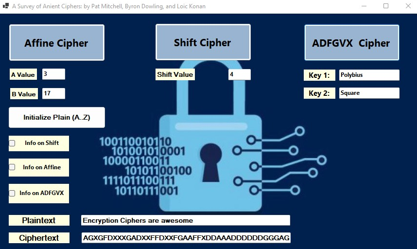

## P03 - Cipher GUI

### Loic Konan

#### Description

- **Ciphers** Implemented
  - **Affine** Cipher
  - **Simple** Shift Cipher
  - **ADFGVX** Cipher

- This Gui take a plaintext message along with that cipher's input values / keys and encrypt the message.

#### How to run the Bonus program

- Run the Gui buy clicking on the play button on the Cipher GUI.sln
- Used visual studio 2022

### Files

|   #   | File                   | Description                                                     |
| :---: | ---------------------- | --------------------------------------------------------------- |
|   1   | Cipher GUI             | Run the Cipher GUI                                              |

### Instructions

- Run the Cipher GUI.sln

### Example Command

- None
